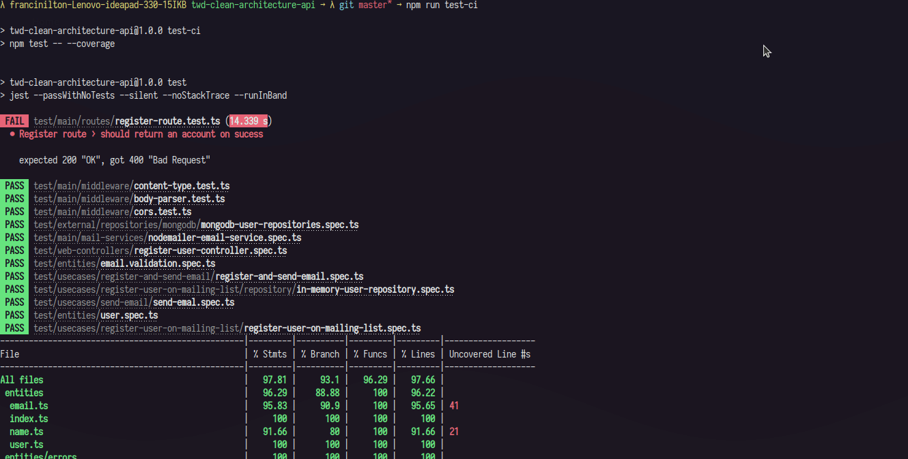

## theWiseDev |API que registra usuários em banco e notifica por email

# 📜 Sobre

Foi desenvolvido utilizando métodos como Clean Architecture com Node.js utilizando Typescript.

# 🧑‍💻 Tecnologias utilizadas

- [Node.js](https://nodejs.org/en/)
- [Typescript](https://www.typescriptlang.org/)
- [Jest](https://jestjs.io/) 

Copyright © 2022 [theWiseDev](https://thewisedev.com.br/)
