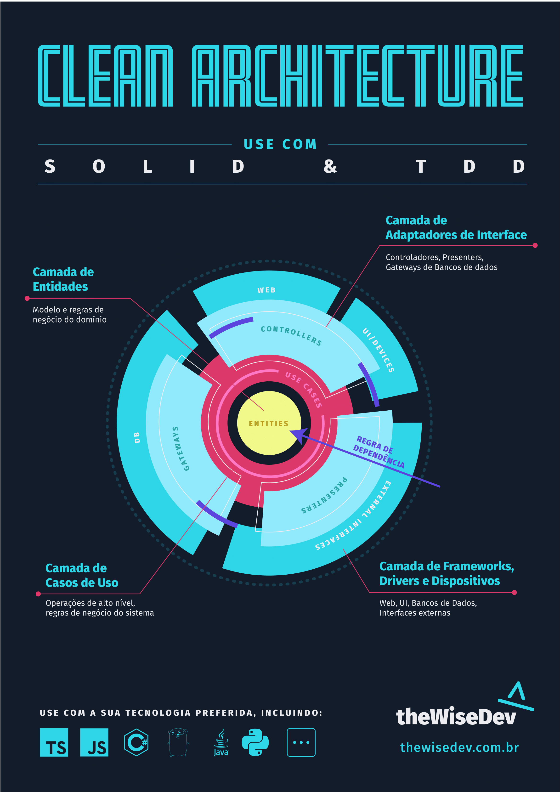

## theWiseDev |API que registra usuários em banco e notifica por email

  

# 📜 Sobre

Em uma API muito simples foi extraído muitos conceitos como SOLID, TDD (Desenvolvimento guiado por testes) e tratamento de erros como either. 

# 🧑‍💻 Tecnologias utilizadas

- [Node.js](https://nodejs.org/en/)
- [Typescript](https://www.typescriptlang.org/)
- [Jest](https://jestjs.io/) 

Copyright © 2022 [theWiseDev](https://thewisedev.com.br/)
